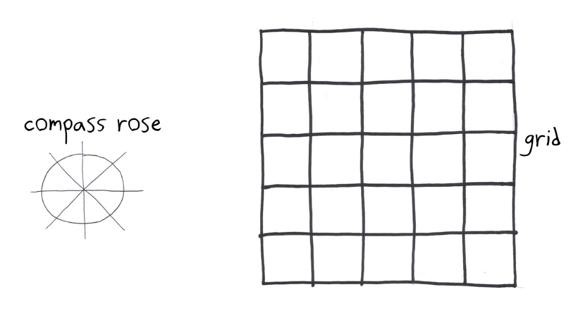
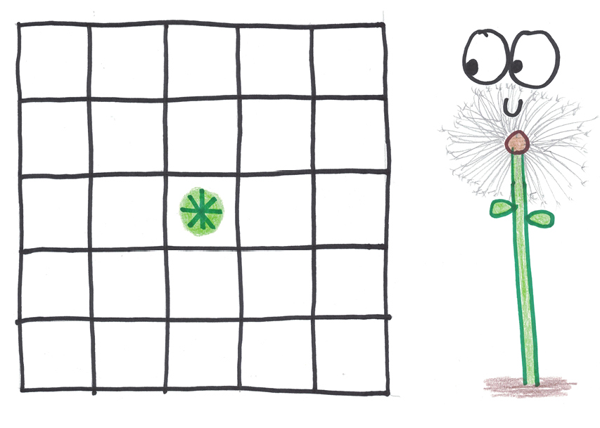
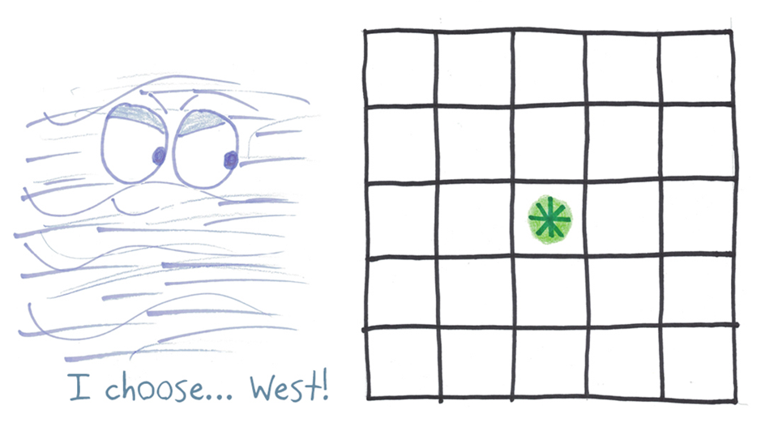
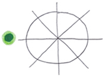
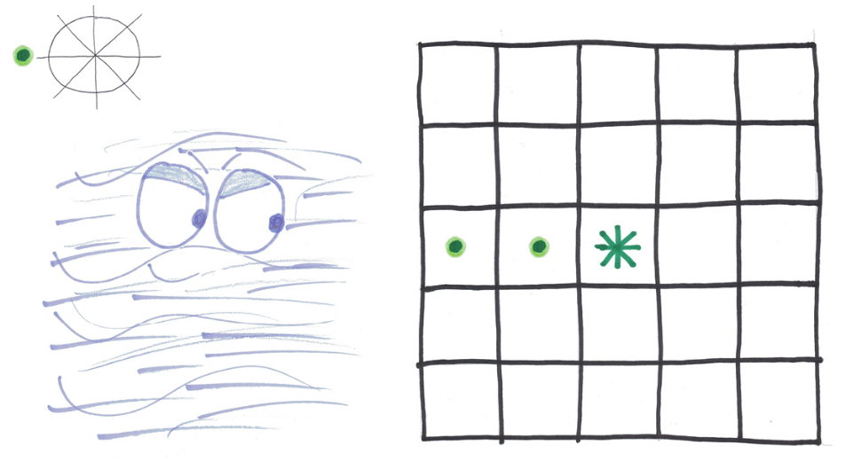
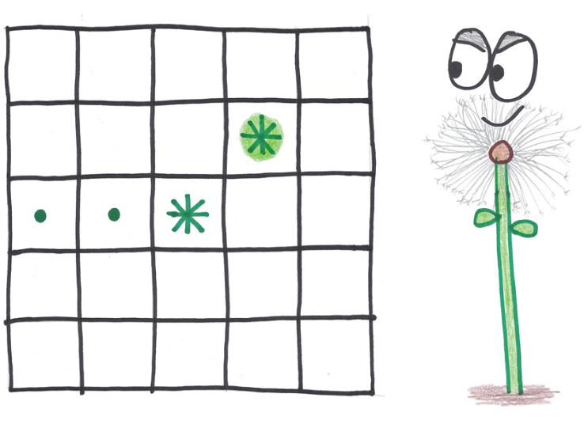
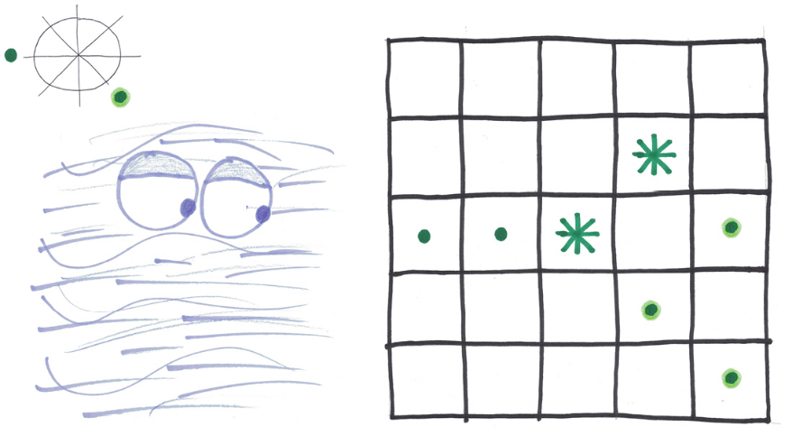
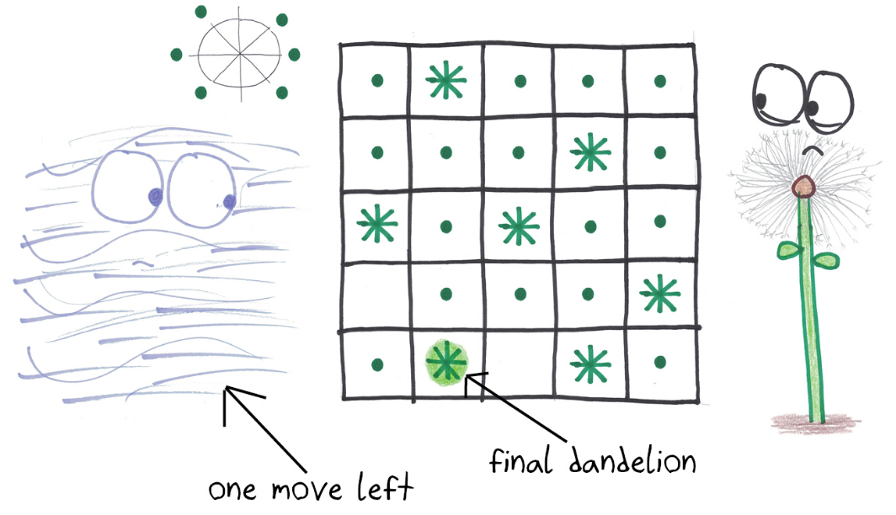
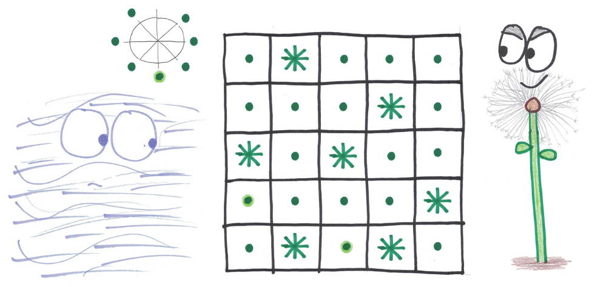

**Dandelions**

I know your dreams, my friend. You wish to be a dandelion, riding the
winds, a sentient piece of fluff borne across the fields of—

No, wait, I’m sorry. Misread that dream. You wish to be the wind itself,
sweeping the fluff from the dandelions and carrying it—

No, wait. I see now. You want to be… *both*?

Aha! I have just the game for you.

**How to Play**

**How many players?** Two: the Dandelions, and the Wind.

{width="3.1180555555555554in"
height="1.780792869641295in"}

**What do you need?** Paper and pencil. Draw a five-by-five grid, plus a
little compass rose.

{width="4.298583770778652in" height="2.3125in"}

**What’s the goal?** The Dandelions aim to cover the whole meadow. The
Wind aims to leave at least one square of the meadow uncovered.

**What are the rules?**

1.  The Dandelions move first, by **placing a flower** (i.e., an
    asterisk) anywhere in the grid.

{width="3.7350853018372705in"
height="2.6666666666666665in"}

1.  The Wind moves next, by **blowing a gust in any of the eight
    directions**: North, South, Northwest, Southeast, and so on. (Note:
    unlike meteorologists, for whom a Northern wind blows *from* the
    North, I call a wind “North” if it blows *toward* the North.)

{width="4.964760498687664in"
height="2.7847222222222223in"}

(The wind may blow **only once in each direction**, so once a direction
is used, mark it off on the compass rose.)

{width="1.7226968503937008in"
height="1.2847222222222223in"}

1.  Every dandelion’s **seeds are carried in the wind’s direction**. Any
    vacant square downwind of a dandelion is now occupied by a seed
    (i.e., a dot).

{width="4.326388888888889in"
height="2.401492782152231in"}

1.  Continue taking turns. A **dandelion is planted**…

    {width="3.3541666666666665in"
    height="2.4586570428696413in"}

    …and then **the wind blows, carrying the seeds of ALL dandelions**
    on the board.

{width="3.986111111111111in"
height="2.1955588363954504in"}

1.  You may, if you like, plant a new dandelion **where there is already
    a seed**.

{width="4.701388888888889in"
height="2.516447944006999in"}

1.  **Each player gets 7 moves**. Thus, a total of 7 dandelions are
    planted, and the wind blows 7 times (using up every direction except
    one).

{width="4.819444444444445in"
height="2.7731135170603674in"}

1.  If the dandelions and their seeds **cover the whole board**, **then
    the Dandelions win.**

{width="4.423611111111111in"
height="2.147935258092738in"}

1.  If not, then **the Wind wins**.

{width="4.888888888888889in"
height="2.530718503937008in"}

**Variations**

**Larger Meadow:** If the Dandelions are finding victory too easy, try a
6 by 6 grid.

**Double Planting:** If the Wind is finding victory too easy, then have
the dandelions begin the game with a “double turn” (i.e., two Dandelions
are planted), while the Wind ends the game with a “double turn” (i.e.,
after the seventh Dandelion is planted, the wind blows twice).

**Keeping Score:** Switch to a larger board (I suggest 7 by 7), so that
the Dandelions will struggle to cover the full board. Play one round
each as the Dandelions and as the Wind. As the Wind, you score a point
for each square that’s left uncovered.

**Collaborative (or Solo):** Have the wind work *together* with the
Dandelions, so that both want to cover the whole board. What’s the
largest board you can manage? (Start with 8 by 8.)

**The Collaborative Puzzle:** With collaborative play, how many squares
can the Dandelions cover on an *n* by *n* grid? (An open mathematical
problem!)

