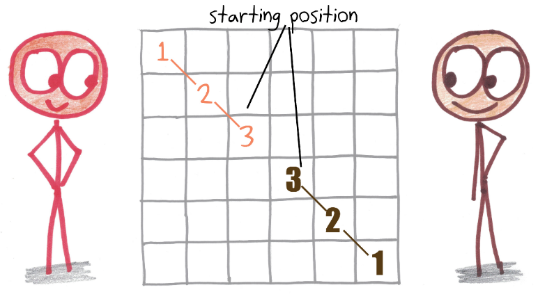
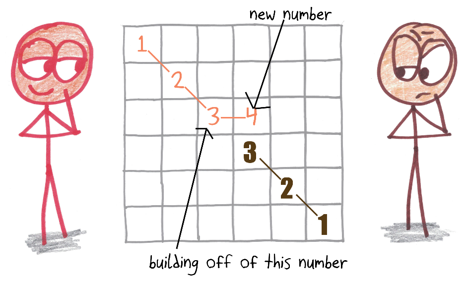
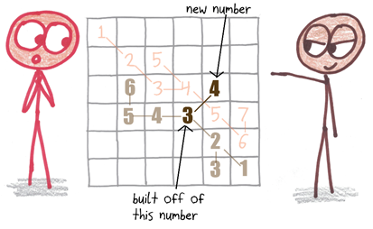
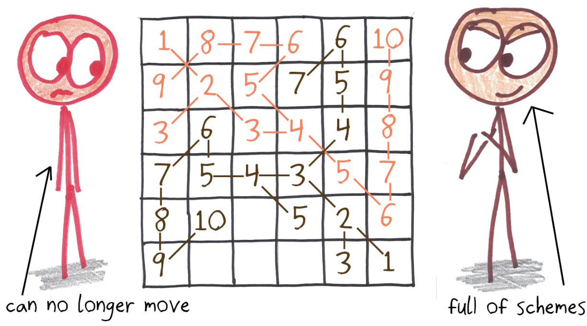
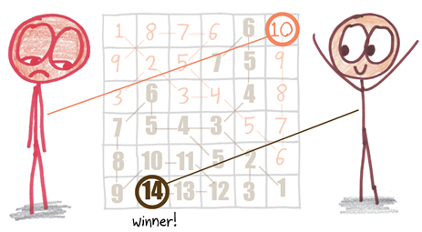

**Sequencium\
*A Game of Rival Chains***

S

**How to Play**

**What do you need?** Two players, using different colors on a 6-by-6
grid. Set up the board like this. (For a longer game, you can try
8-by-8, or 7-by-7 with the middle square blacked out.)

{width="3.9652777777777777in"
height="2.065336832895888in"}

**What’s the goal?** Reach a higher maximum number than your opponent
reaches.

**What are the rules?**

1.  On each turn, (a) **pick one your existing numbers**, (b) **add
    one** to it, and (c) write the **new number in an adjacent cell**.
    Diagonals count as adjacent.

{width="4.3125in" height="2.555214348206474in"}

1.  You may **build off of any of your existing numbers**, as long as
    there is space to do so. Also note that it’s **okay to cross an
    existing path** along a diagonal.

{width="4.159722222222222in"
height="2.910917541557305in"}

\[*show a diagonal cross in the picture*\]

1.  Play **until the board fills up**, even if one player becomes unable
    to move.

{width="5.555555555555555in"
height="3.0923556430446193in"}

1.  The winner is whoever, in the end, has the **highest number in
    play**.

{width="5.4375in" height="3.0880347769028873in"}

1.  The game described thus far has an Achilles heel: the second player,
    by mirroring the moves of the first, can guarantee a draw. I thus
    advise a simple tweak: **starting with the second player’s first
    turn,** **each player moves twice per turn**. (The first player’s
    opening turn remains a single move.)

**Tasting Notes**

Sequencium is sneaky little shapeshifter: a spatial game, disguised as a
number game.

The numbers, as you’ll see, are just a surface feature. They’re nothing
more than a way to track the length of the chains that you’re building.
To build the longest chain, you’ll need to turn off your numerical
brain, and turn on your territorial brain. Where is your opponent
threatening to extend her forces? Where can you extend yours?

By the end of the game, you may feel less like rival humans, and more
like rival sentient plants, each sending forth your tendrils to choke
off your enemy’s growth and secure your own.

**Where It Comes From**

One of my very favorite minds belongs to a fellow named Walter Joris. He
generates games, puzzles, and peculiar pencil-and-paper experiments with
such intensity and regularity that he must be a kind of pulsar: some
heretofore unknown astronomical object, emitting what I admiringly call
Joris Radiation.

His book is called *100 Strategic Games*, but Walter has actually
created more like 150 or 200. You lose track when you’re that prolific.
But he hasn’t lost track of which is his favorite: of all those dozen
dozens, his crown jewel is Sequencium.

**Why It Matters**

**Variations**

**Four Players:** Play on
larger grid (8 by 8 or 10 by 10), with each player’s chain beginning in
a different corner.

**Feedback**

“Are you allowed to add other 1s if you want to or do you always have to
build off of what you put down that first 1?”

“it took part of a game to realize that making vertical or horizontal
moves block your opponent and making a diagonal move doesn’t.”

“What if the both players have the same highest number? One solution is
to use count the occurencies of highest/next to highest number etc.”

“What happens if both players have the same max? Three obvious options:
draw, cross out pairs of matching highest numbers until unique victor,
second player victory (if not using 12\*)”

“I forgot about putting the 123 in to start.”

Kisenwether: “Break the symmetry and what you have left behind is a gem
of a game. For something so simple, there is a lot of depth of
strategy/tactics here. Even different styles of play - do you block of
territory of your own, or concentrate on cutting off your opponent? Do
you you "stick with them" making sure you keep your high numbers in the
same areas as theirs, or try to push them out of your space? So much
fun, I will play this again and again. And the rules are so simple. How
is it that this game isn't ancient? You'd think it would have come into
existence long ago. It feels like a classic.”

Dylan Kane: “I found our games ending with lower scores the better we
got at it. There are games where early on one side seems to have an
advantage, but one strategic defensive move suddenly transforms the
game.”

**Variations:** “Rule variation ideas: 1.) To have more conditions in
place for when a player can cross another player's line 3.) To place an
extra "seed", especially in a larger grid. (ex. 8x8 grid, seed numbers
go from 1 to 4, and then each player can choose a random square to place
a 1 or 0) “

**Variations:** “It has been suggested that new 'seeds' could be added
even after the opening...I could see this being very useful for blocking
an otherwise foregone conclusion , but would probably work better on a
larger board, and possibly consuming both moves if using 12\*. Also (and
this is a bit further afield, but just spitballing) I wonder how the
dynamics would change if one player could build kingwise per normal, and
the other could jump one or two spaces rookwise regardless what was
between? Or knight-wise for that matter?”

**Variations:** I enjoyed a variant where the first move can be made
anywhere on the board for each player… That said, I do like the feature
that it starts with diagonal moves, to create opportunity for more
diagonal moves in the future.

**Variations:** \* allow each player to place the initial 3 numbers
wherever they want on the board, provided they are connected. This
opened up a new strategy debate and a lot of fun.

**Some cool variations:** 4-player variation. we also thought that
getting a loop was very aesthetically pleasing and though maybe it
should give an extra point. since it seems to me that controlling the
center square gives a good advantage, we thought about making it a
special square which takes down a point from the largest chain you have.
boards which are tiled with triangles, not squares.

**Variation:** Could you play highest total score after a series of 3
games? (that would give a reason to continue to play after it's clear
who the winner will be)

**Variations:** How would starting with the first three numbers in a
column or row change the game-play? What if the numbers increased when
played horizontally or vertically, but stayed the same if you chose to
move diagonally?

**Four-player variant:** maybe a four player variant with a bigger board
would be nice. Each player could start from one corner, and you would
have more choices to consider.

**Alternate goal:** An interesting alternative would be aiming to make
the total of all your numbers as large as possible (meaning that all
remaining areas of the board could matter).
